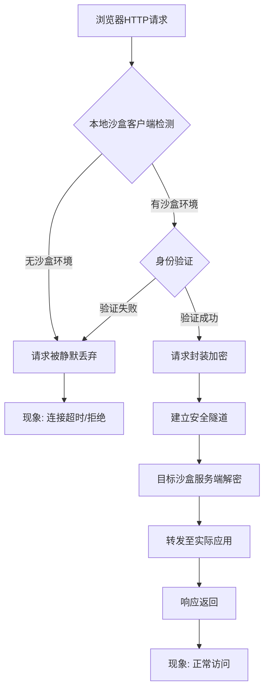
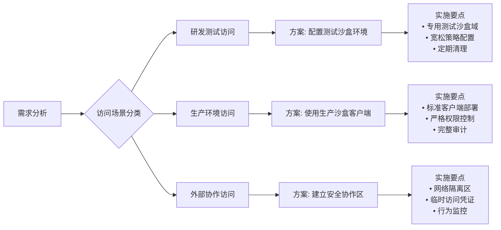

# 关于加密沙盒环境下网页访问异常的排查分析与技术报告

## 1. 故障现象描述

### 1.1 初始状态

- **时间**：202x年X月X日
- **环境**：公司内部研发网络环境
- **主机配置**：
  - 主机A：通过路由器LAN口接入的开发测试机（未安装加密沙盒客户端）
  - 主机B：部署在内网站点的加密沙盒服务器（运行Node.js应用）
  - 主机C：另一台加密沙盒授权客户端
- **异常现象**：
  - 主机A可成功ping通主机B（ICMP协议）
  - 主机A可访问网关及其他内网服务
  - 主机A无法通过HTTP/HTTPS协议访问主机B上的Web应用
  - 主机C可正常访问主机B的Web应用

### 1.2 排查过程记录

| 阶段     | 操作                | 结果                                          | 结论                 |
| :------- | :------------------ | :-------------------------------------------- | :------------------- |
| 第一阶段 | 检查网络连通性      | Ping测试正常，网络层可达                      | 排除基础网络故障     |
| 第二阶段 | 检查防火墙日志      | 仅发现Node.js进程拦截记录，无HTTP请求相关记录 | 常规防火墙未拦截     |
| 第三阶段 | 检查Winsock拦截记录 | 未发现明显异常记录                            | 需深入应用层分析     |
| 第四阶段 | 绘制网络拓扑图      | 可视化网络结构                                | 发现环境差异关键线索 |
| 第五阶段 | 沙盒主机间测试      | 主机C可正常访问主机B                          | 问题定位至环境策略   |

## 2. 技术原理深度分析

### 2.1 加密沙盒的安全架构原理

#### 2.1.1 分层隔离机制

text

```
┌─────────────────────────────────────────────┐
│           应用层控制策略                    │
│  ┌─────────────────────────────────────┐  │
│  │ HTTP/HTTPS请求深度识别与过滤        │  │
│  │ • 身份验证                          │  │
│  │ • 环境检测                          │  │
│  │ • 资源权限校验                      │  │
│  └─────────────────────────────────────┘  │
├─────────────────────────────────────────────┤
│           传输层/网络层通道                │
│  ┌─────────────────────────────────────┐  │
│  │ TCP/UDP/ICMP基础通信                │  │
│  │ • 端口访问                          │  │
│  │ • IP连通性                          │  │
│  └─────────────────────────────────────┘  │
└─────────────────────────────────────────────┘
```


#### 2.1.2 沙盒策略执行点分析




### 2.2 协议层差异化处理机制

#### 2.2.1 ICMP协议（Ping）处理

- **工作层级**：网络层（OSI第三层）
- **沙盒策略**：通常不干预基础网络连通性测试
- **目的**：保持网络运维可行性
- **结果**：显示"网络可达"的假象

#### 2.2.2 HTTP协议处理

- **工作层级**：应用层（OSI第七层）
- **沙盒策略**：强制执行深度包检测与访问控制
- **控制点**：
  1. Winsock API调用拦截
  2. 进程身份验证
  3. 环境完整性校验
  4. 资源权限映射
- **结果**：未经授权访问被拒绝

### 2.3 日志记录机制差异

| 日志系统            | 记录层级      | 可见性           | 本次故障相关度 |
| :------------------ | :------------ | :--------------- | :------------- |
| Windows防火墙       | 网络层/传输层 | 高               | 低             |
| 加密沙盒审计日志    | 应用层/会话层 | 低（需专用工具） | 高             |
| Winsock提供程序日志 | 套接字API层   | 中等             | 中等           |
| 系统事件日志        | 综合记录      | 高               | 低             |

## 3. 根本原因分析

### 3.1 直接原因

加密沙盒客户端的安全策略机制明确禁止非沙盒环境向受保护资源发起应用层访问请求。具体表现为：

1. **身份认证缺失**：主机A未安装或未正确配置加密沙盒客户端
2. **环境标签不匹配**：请求缺少合法的沙盒环境标识
3. **隧道建立失败**：无法建立加密的安全通信通道

### 3.2 技术本质

此现象体现了现代数据安全产品的核心设计理念：

yaml

```
安全模型: 零信任架构
核心原则:
  - 从不信任, 始终验证
  - 网络位置非信任依据
  - 最小权限原则
实现机制:
  - 基于身份的访问控制
  - 环境感知的安全策略
  - 端到端的加密隧道
  - 应用层深度检测
```


### 3.3 策略逻辑解析

text

```
访问请求处理流程：
1. 请求到达目标主机网络接口
2. 操作系统网络栈处理基础协议
3. 加密沙盒驱动/过滤器拦截应用层请求
4. 执行策略检查：
   ✅ 来源IP是否在允许列表？ → 是（同网段）
   ❌ 来源主机是否有有效沙盒身份？ → 否
   ❌ 请求是否携带合法令牌？ → 否
   ❌ 通信是否需要建立加密隧道？ → 是（但无法建立）
5. 策略判定：拒绝访问
6. 静默丢弃请求或返回连接重置
```


## 4. 解决方案与验证

### 4.1 临时解决方案

1. **沙盒环境内测试**：使用已授权的加密沙盒主机进行访问测试
2. **仿真工具辅助**：使用移动端仿真软件进行界面功能验证
3. **策略例外申请**：如需从非沙盒主机访问，需走正式审批流程

### 4.2 根本解决方案




### 4.3 验证结果

| 测试场景                | 协议类型   | 预期结果 | 实际结果   | 结论         |
| :---------------------- | :--------- | :------- | :--------- | :----------- |
| 沙盒主机 → 沙盒服务器   | HTTP/HTTPS | 正常访问 | ✅ 成功     | 策略正常     |
| 非沙盒主机 → 沙盒服务器 | ICMP       | 网络可达 | ✅ 成功     | 基础网络正常 |
| 非沙盒主机 → 沙盒服务器 | HTTP       | 访问拒绝 | ✅ 符合策略 | 安全策略生效 |
| 移动设备 → 沙盒服务器   | HTTP       | 访问拒绝 | ✅ 符合策略 | 跨平台一致性 |

## 5. 经验总结与改进措施

### 5.1 技术认知提升

#### 5.1.1 网络知识与安全产品的融合理解

- **传统网络观**：网络连通性 ≈ 服务可访问性
- **现代安全观**：网络连通性 ≠ 服务可访问性
- **关键认知**：必须考虑安全中间件对OSI各层协议的差异化处理

#### 5.1.2 静态路由知识的实践应用

- **问题回溯**：初期对内网跨子网访问的困惑
- **知识缺口**：对静态路由在企业安全环境中的特殊配置理解不足
- **学习要点**：安全设备可能修改路由策略，需结合具体产品分析

### 5.2 排查方法论优化

#### 5.2.1 建立结构化排查框架

text

```
故障现象 → 基础网络测试 → 协议分层验证 → 安全策略检查 → 产品特性分析 → 环境差异对比
```


#### 5.2.2 工具与日志系统熟悉度

- **关键发现**：不同安全产品使用独立的审计日志系统
- **改进措施**：
  1. 建立公司内部安全产品日志查询指南
  2. 定期参加产品厂商的技术培训
  3. 创建常见故障现象与对应日志系统的映射表

### 5.3 预防性措施建议

#### 5.3.1 文档建设

1. **网络拓扑图标准化**：包含安全设备位置与策略影响范围标注
2. **访问矩阵文档**：明确各类资源对不同环境的访问策略
3. **快速排查手册**：针对常见混合环境问题提供检查清单

#### 5.3.2 流程优化

1. **新环境接入检查表**：确保包含安全客户端状态验证
2. **跨团队协作机制**：网络、安全、应用团队联合排查机制
3. **知识共享平台**：建立内部技术案例库

#### 5.3.3 技术储备

1. **Winsock深入理解**：掌握Windows网络栈架构与安全提供程序机制
2. **零信任架构学习**：理解现代企业安全设计理念
3. **沙盒技术原理**：深入研究各类沙盒产品的实现机制

## 6. 结论

本次访问异常事件本质上是加密沙盒安全策略的正常表现，而非系统故障。它揭示了在现代企业混合IT环境中，传统网络运维思维向 **融合网络安全、应用安全和数据安全的综合治理思维** 转型。

关键启示：

1. **协议分层意识**：不同层级协议可能受到完全不同的策略控制
2. **环境上下文敏感性**：在安全强化环境中，设备身份和环境状态决定访问权限
3. **日志系统多样性**：需熟悉企业部署的各类安全产品的独立审计机制
4. **产品特性前置认知**：对新引入的安全产品需提前了解其核心机制和影响范围

建议将本次排查过程中形成的检查方法和分析框架，固化为团队的标准操作流程，提升对类似复合型问题的响应效率和分析深度。
