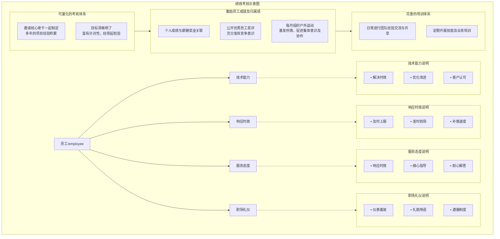

# 甲方公司桌面运维项目服务（投标）

**乙方公司**：XX信息技术服务有限公司

**编制日期**：2021年4月

**版本**：V1.0

## 更新记录

| 日期       | 编制成员 | 版本 | 更新内容           |
| ---------- | -------- | ---- | ------------------ |
| 2021-04-01 | 胡工程师 | V1.0 | 初稿编制与内容完善 |
| —          | —        | —    | —                  |

（后续更新将记录变更日期、人员、版本及具体修改内容）

## 项目概述

### 项目背景

甲方公司作为一家大型金融机构，其桌面办公系统涉及数百台个人办公电脑、打印机、扫描仪及其他信息化设备。日常运维需求主要包括：

- 个人办公电脑软硬件维护
- 打印机/扫描仪共享安装及故障处理
- 桌面管控、杀毒软件安装及日常监测
- 网络安全准入管理
- IT固定资产登记与盘点
- 视频会议现场技术支持

为确保公司办公信息化环境稳定、高效运行，降低因设备故障导致的业务中断风险，甲方拟采购专业桌面运维外包服务。本投标书即针对该需求提出全面、专业的服务方案。

### 项目范围

本项目服务范围涵盖：

- 个人桌面办公软硬件系统维护
- 桌面安全管控及杀毒软件管理
- 网络安全准入认证与维护
- IT固定资产登记、盘点及变更管理
- 视频会议系统现场调试与支持
- 机房日常巡检、安防消防辅助巡视
- 其他相关日常IT辅助工作

### 项目目标

- 保障甲方日常办公系统稳定运行，故障快速响应与解决
- 协助甲方IT部门开展综合管控，提升整体信息安全水平
- 确保各项IT任务按期、高质量完成，提高用户满意度
- 通过专业服务降低甲方IT运维成本与管理负担

## 运维服务方案

### 服务期限

2021年4月1日至2022年4月1日（一年期，可根据合同续签）。

### 核心服务内容

1. **桌面维护**
   - 主机软硬件安装、调试、优化
   - 常用办公软件（OA、Office套件等）故障诊断与处理
   - 系统重装、数据备份与恢复（严格确认备份后操作）
2. **打印机/扫描仪维护**
   - 共享打印机安装、权限配置
   - 日常故障处理（卡纸、硒鼓、驱动、连接问题等）
   - 耗材更换指导与报备
3. **网络安全管理**
   - 上网认证账号分配、维护与端口绑定
   - 防病毒软件安装、更新、病毒查杀
   - 系统补丁推送与合规检查
   - 桌面安全准入控制
4. **固定资产管理**
   - 配合甲方完成IT资产盘点、标签粘贴、变更登记
   - 建立电子台账，定期更新资产状态
5. **网络维护**
   - 机房跳线调整、网络端口调试
   - 常见网络故障排查（IP冲突、认证失败、链路问题等）
6. **现场支持**
   - 视频会议设备调试、现场保障
   - 机房安防、消防巡视及日常辅助工作

### 服务标准

**工作时间**

- 周一至周六：6×12小时驻场服务（9:00–21:00）
- 节假日：7×24小时电话支持，重大故障2小时内现场响应

**响应与解决时限**（参考行业标准SLA）

| 服务类型 | 响应时间 | 到达现场时间 | 解决时间 | 备注             |
| -------- | -------- | ------------ | -------- | ---------------- |
| 硬件故障 | 10分钟   | 20分钟       | 60分钟   | 重点业务用户优先 |
| 软件故障 | 10分钟   | 20分钟       | 120分钟  | 所有办公用户     |
| 网络故障 | 10分钟   | 20分钟       | 90分钟   | 视影响范围调整   |

**故障解决率** 周一至周六工作日内，总体故障解决率不低于96%（首呼解决率目标≥85%）。

**服务方式**

- 驻场工程师现场支持（主要方式）
- 电话/邮件/企业微信快速响应
- 远程桌面/工具支持
- ITSM运维平台自助报障入口（含工单跟踪、知识库）

**服务承诺**

- 周一至周五工作日故障解决率≥96%
- 季度服务投诉累计不超过5次，重大投诉不超过2次
- 月度用户满意度调查得分≥96%

## 组织结构与项目团队

### 项目组织架构

乙方为本项目组建4人核心团队 + 后备资源池，确保服务连续性与质量。

| 角色          | 姓名     | 主要职责                                 |
| ------------- | -------- | ---------------------------------------- |
| 项目经理      | 李经理   | 项目整体统筹、甲方高层对接、SLA监督      |
| 客户经理      | 赵经理   | 商务协调、电话支持、投诉处理             |
| 驻场工程师    | 刘工程师 | 日常桌面、网络、外设维护、资产登记       |
| 技术支持/备件 | 蒲工程师 | 二线技术支援、物资配送、疑难故障升级处理 |

**事件升级流程**： 用户报障 → 驻场工程师处理 → 疑难升级 → 项目助理/二线支援 → 项目经理决策 → 必要时公司资源池调配。

**人员保障**

- 所有驻场人员购买五险一金，严格遵守国家劳动法加班规定
- 后备团队（公司资源池约20人）确保人员离职/缺岗时1–2日内无缝交接

## 项目管控制度

### 质量管理活动

1. **管控指标制定与评审**：周期性评审服务目标、SLA指标、组织结构
2. **管理评审**：年度评估服务体系适宜性、有效性，确定改进方向
3. **服务改进规划**：季度分析问题、差距，批准整改措施
4. **客户满意度调查**：
   - 项目级：每单工单7日内回访满意度
   - 公司级：年度问卷调查（回收率目标≥80%）
5. **内审与质量分析**：季度质量分析会，监控SLA达成率，提出优化建议

### 员工KPI考核

驻场工程师考核维度：

- 服务态度（礼貌、耐心、主动性）
- 响应时效（及时到场、上报）
- 技术能力（解决效率、优化建议、客户认可）
- 职场礼仪（着装、用语、制度遵守）
- 其他：工单完成率、及时率、用户满意度

**考核结果**与季度绩效、年终奖金直接挂钩。首季度综合得分<80分，将申请更换人员。

**团队建设**：每周组织文体活动（乒乓球、足球）、双周户外拓展，提升凝聚力与稳定性。

## 满意度调查及分析

- **调查方式**：问卷星在线问卷 + 电话回访
- **主要维度**：响应速度、服务态度、专业能力、问题解决质量
- **分析机制**：低于目标分值时，分析原因（人员配比、期望值、技能等），制定针对性改进计划

**满意度计算**：（非常满意 + 满意）/ 总样本 × 100%，目标≥96%。

## 团队KPI考核指标及激励/处罚措施

**季度评分**（满分100分，可加分项：表扬、重大贡献等）：

| 等级 | 分数范围 | 奖金系数 |
| ---- | -------- | -------- |
| A    | >100分   | 1.1      |
| B    | 90–100分 | 1.0      |
| C    | 80–89分  | 0.9      |

奖金与工单量、解决率、满意度、零重大违规等挂钩。

## 安全管理

- 严格遵守甲方保密要求，未经书面授权不得泄露任何信息
- 现场人员遵守甲方规章，违规操作导致损失由乙方承担
- 提供员工人身安全保障，发生事故负责善后及赔偿

## 应急保障

### 预案目标

预防为主、快速响应，最大限度减少突发事件影响，保障人员与财产安全。

### 突发事件分类

1. 火灾事件
2. 治安事件
3. 设备重大事故（机房瘫痪）
4. 大范围病毒/网络攻击
5. 自然灾害
6. 大型活动技术保障

### 处置流程（以设备事故为例）

1. **发现与报告**：立即上报甲方负责人
2. **应急响应**：启用备用系统、判断故障类型、联系厂商/调备件、保护数据
3. **收尾**：恢复系统、写报告、终止预案、制定整改措施

**人力保障**：公司资源池20+人，校企合作每年输送50+实习生，快速补充。 **物资保障**：完善备机备件库（整机+零部件），3–4小时内无法修复的紧急故障优先调备机。

**预警与防范**：24小时安防监控、定期巡检、预案演练、员工安全培训。

## 其他说明

**乙方承诺**： XX信息技术服务有限公司郑重承诺，以专业、高效、可靠的服务全力保障甲方办公环境稳定运行。如中标，我们将严格履行投标书各项内容，超出合同要求提供增值服务，与甲方共同打造高效IT支撑体系。

**联系人**：李经理

* **电话**：138-XXXX-XXXX

* **邮箱**：[limanager@xxit.com](mailto:limanager@xxit.com)

**XX信息技术服务有限公司** 2021年4月
